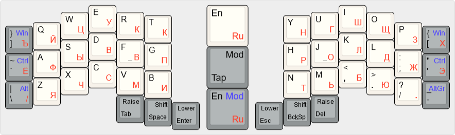
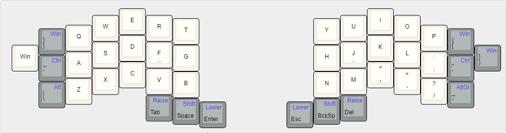

Watchman’s Layouts are several layout options for ergo keyboards with 42/44 keys, such as: [corne](https://github.com/foostan/crkbd) / [jian](https://github.com/KGOH/Jian-Info) / [jorne](https://github.com/joric/jorne/) / [jorian](https://github.com/joric/jorian) / [quasi 42](http://ibnteo.klava.org/keyboard/quasi42-2) / [centromere](https://southpawdesign.net/products/centromere-wireless-keyboard?variant=8868004724796) / [chimera ergo 42](https://github.com/GlenPickle/Chimera) / [mooncake 42](https://github.com/aroum/mooncake42) / [enki 42](https://github.com/aroum/enki42). The idea is to place all the symbols I use on the main layer: for example: “[  ] ` - \”, which are often on an extra layer in other layouts. And also have a full set of modifiers for each hand. This is achieved through the use of Mod-Tap.




* [Regular edition](http://www.keyboard-layout-editor.com/#/gists/246772cb72fa2de02354d5cb1add6b2b)
 – the layout is as close as possible to the layout of a regular keyboard: numbers, symbols and function keys are arranged in rows.

* [Advanced edition](http://www.keyboard-layout-editor.com/#/gists/d5593906579fe6564cd1701fccca1e62) - a improved version of the regular edition. It was developed after several months of using the regular edition. It seemed to me more convenient to arrange to have all the numbers, all the symbols and all the functional keys in the form of clusters for use with one hand, arranged in the manner of a numpad.

* [Numpad edition](http://www.keyboard-layout-editor.com/#/gists/ac3aeb8844fee4f92e167979eb98936a)
 – an option for those who often need a numpad and do not want to clamp two modifiers.  This is the same as the advanced edition, but instead of the navigation cluster, numpad is used.

* [Commander edition](http://www.keyboard-layout-editor.com/#/gists/a9f4aa4ac14d66351b3cfa98a42d9165) - an option for working with dual-pane file managers. they only need F1-F7. Also, the Raise layer is symmetrical for both halves.

* [Mouse edition](http://www.keyboard-layout-editor.com/#/gists/801abfb3cb21604b13db734a4d04d559) - same as Commander edition, but with mouse emulation

## The repository contains:
* ```config*.c``` QMK files for 44/42/36/34 keys keyboard
* ```*.json``` files for VIA for jian and corne 
* ```*.json``` KLE files 
* ```*.png```  KLE images

## Use:
### QMK
* Copy ```qmk/keymap*.c``` to ```YOUR_KEYBOARD/keymaps/default/``` and rename it to keymap.c
  
* Add to YOUR_KEYBOARD/krules.mk:
  ```
  MOUSEKEY_ENABLE = yes
  ```

* If you need RGB layer indicator(else remove RGB section from keymap.c)
  * Add to ```YOUR_KEYBOARD/krules.mk```:
  ```
  RGBLIGHT_ENABLE = yes
  RGBLIGHT_LAYERS = yes
  ```

  * Add to ```YOUR_KEYBOARD/kconfig.h```:
  ```
  #define RGBLIGHT_LAYERS
  #define RGBLIGHT_MAX_LAYERS 5
  #define RGBLIGHT_LAYERS_OVERRIDE_RGB_OFF
  ```

### VIA [work in progress]
Just load ```via/*.json```

### KLE
Just open link or upload ```kle/*.json``` to [keyboard-layout-editor.com](keyboard-layout-editor.com)

### ZMK [work in progress]
Copy ```zmk/keymap*.c``` to ```YOUR_KEYBOARD/config/``` and rename it to  ```YOUR_KEYBOARD.keymap```

## 44 key

In the variant for 44 keys, 7 columns are duplicated ```Win/]``` for greater compatibility.



